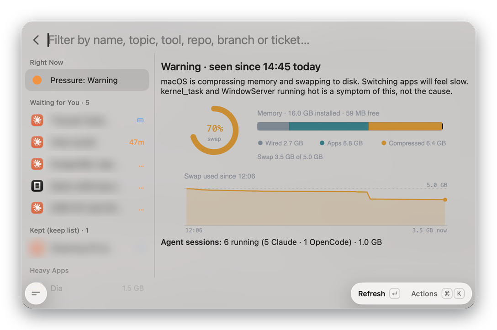
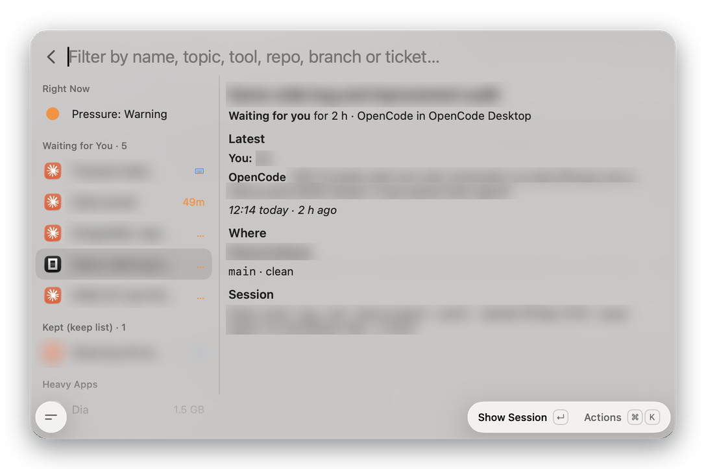
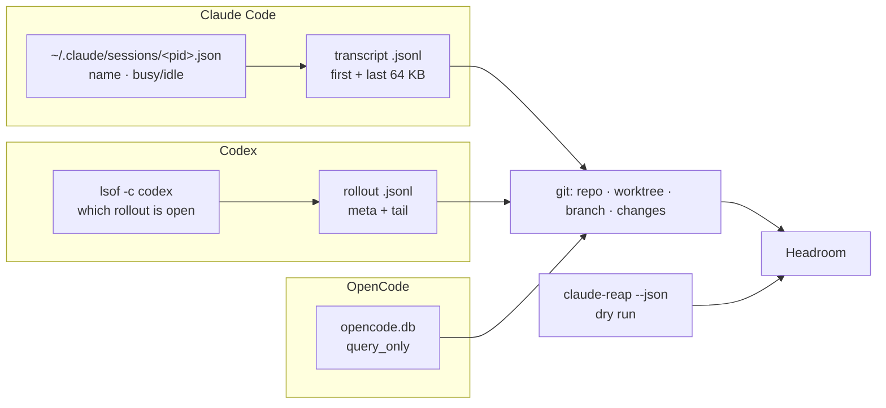

<div align="center">


# Headroom

**See what's eating your Mac's memory, and which AI coding sessions you can close.**

A Tinycast extension for Macs that run many Claude Code, Codex and OpenCode sessions at once.




<sub>Screenshots edited for privacy: session titles and conversation text are blurred.</sub>

</div>

---

## Why

A Mac with 16 GB or less slows to a crawl long before "RAM used" looks alarming: macOS fills free memory with cache, then compresses, then swaps. Meanwhile agent sessions pile up in terminal tabs for days. Headroom puts both on one screen and answers two questions:

1. **How much headroom is left?** Kernel memory pressure, swap, and what's compressed.
2. **What can go?** Every Claude Code, Codex and OpenCode session: what it's about, where it works, when you last talked to it. Idle ones can be reaped safely.

## Features

<table>
<tr>
<td width="50%" valign="top">

### Memory, honestly
- **Pressure straight from the kernel** (`kern.memorystatus_vm_pressure_level`), not a threshold we invent
- **"Warning since 11:02"**, and "seen since" when Headroom wasn't watching the moment it changed
- **Swap gauge, memory bar** (wired · apps · compressed) and **swap history**, drawn as one SVG
- **All clear** row when there's nothing to worry about

</td>
<td width="50%" valign="top">

### Every agent session
- **Claude Code, Codex and OpenCode** in one list, grouped as Reapable · Working · Waiting for you · Kept
- **Real names**: Claude's own generated titles, Codex thread names, OpenCode titles
- **Latest exchange**: your last prompt and the agent's last reply
- **Where it works**: main repo (even from a worktree), branch, ticket, uncommitted changes

</td>
</tr>
<tr>
<td width="50%" valign="top">

### Act without leaving
- **Show Session** jumps to its Terminal or iTerm2 tab, its Orca tab when Orca is installed, or the app it runs in
- **Open the ticket in Linear** (set your workspace in preferences), copy the resume command, branch or ticket
- **Quit a heavy app** from a confirm page, with how much it frees
- **Edit the keep list** in place (⌘⇧K)

</td>
<td width="50%" valign="top">

### Reaping you can trust
- **Dry run first**, with the count and size before anything happens
- **Only the PIDs you confirmed** are touched, and re-checked just before
- **Close one working session** on purpose, with its resume command offered first
- **Before / after** swap, free and compressed once it's done

</td>
</tr>
</table>

<div align="center">

</div>

## How it finds sessions

Each tool is found by its own evidence, so a session shows up however it was started: a terminal, an editor, or a desktop app.



| Tool | Live when | Details from |
| --- | --- | --- |
| Claude Code | its process is alive and has a status file | the transcript's two ends: `ai-title`, first prompt, last prompt and reply, edited files |
| Codex | a `codex` process holds its rollout file open | the rollout's meta line and tail; thread names from `session_index.jsonl` |
| OpenCode | OpenCode is running and the session changed in the last 24 h | one read-only SQL query per refresh |

## Built for a Mac that's short on memory

Headroom exists because the machine is already struggling, so it must not add to it.

| | Budget | How |
| --- | --- | --- |
| Background cost | **zero** | nothing runs while the window is closed |
| Memory refresh | 2 tiny commands every 5 s | one `sysctl`, one `vm_stat` |
| Sessions refresh | every 15 s, in two passes | rows first, then git fills in repo and branch |
| Transcripts | first + last 64 KB only | a 62 MB transcript costs the same as a small one; cached until it grows |
| Git | once per repo, cached 30 s | repo roots found by walking up for `.git`, not by running git |
| Measured scan | ~70 ms fast pass, ~100 ms full | 6 sessions across 3 tools, warm cache |

It also stays clear of the things that break in Tinycast: no `nettop`, `system_profiler` or `ioreg`, no binary command output (Tinycast's UTF-8 decoder throws on invalid bytes), one image per detail panel, and no native alerts (they take focus and Tinycast hides its window).

## Safe reaping with claude-reap

Headroom never sends a signal itself. Reaping goes through `claude-reap`, a small shell script bundled with the extension (`assets/claude-reap`), which keeps the safety rules in one place: it skips its own process chain, the current terminal and anything on the keep list, and decides idleness by **terminal idle time**, not process age.

```sh
claude-reap --json                                      # dry run
claude-reap --json --apply --only 12345                 # reap only what you confirmed
claude-reap --json --apply --only 12345 --ignore-idle   # close one chosen session
```

`--ignore-idle` is refused without `--only`, so it can never widen a scan.

## Install

Requires macOS and Tinycast 0.11.3.

**From a release** (no Node needed):

1. Download `tinycast-headroom.zip` from [Releases](https://github.com/RodrigoAlegria/tinycast-headroom/releases) and check it against `SHA256SUMS`.
2. Extract the `tinycast-headroom` folder into `~/Library/Application Support/com.tinycast.app/extensions/` (Finder: **Go → Go to Folder**, or ⌘⇧G).
3. Restart Tinycast and search **Headroom**.

**From source**:

```sh
git clone https://github.com/RodrigoAlegria/tinycast-headroom.git
cd tinycast-headroom
npm ci && npm test && npm run build && npm run install-local
```

Restart Tinycast after the first install, then search **Headroom**, or open
`tinycast://extensions/rodrigoalegria/tinycast-headroom/index`. To update, replace the folder and reopen the command.

`claude-reap` comes with the extension. It can also run on its own from a terminal: `bash assets/claude-reap --help`.

### Preferences

| Preference | Default | |
| --- | --- | --- |
| Custom claude-reap path | empty | leave empty to use the bundled copy |
| Idle threshold | 2 days | 12 h · 1 day · 2 days · 3 days · 7 days |
| Linear workspace | empty | your workspace slug; Open in Linear stays hidden until it's set |

## Shortcuts

| | |
| --- | --- |
| **↵** | Show Session (Refresh on the Pressure row) |
| **⌃X** | Reap or close the selected session |
| **⌘L** | Open the ticket in Linear |
| **⌘⇧C** | Copy the resume command |
| **⌘⇧R** | Reap everything idle |
| **⌘⇧K** | Edit the keep list |
| **⌘⇧S** | Screenshot the screen (needs Screen Recording permission for Tinycast) |
| **⌘⇧L** | Show the log file |

## Troubleshooting

Headroom logs errors and slow operations to
`~/Library/Application Support/com.tinycast.app/extension-support/tinycast-headroom/headroom.log` (⌘⇧L).

- **Screenshot fails**: System Settings → Privacy & Security → Screen & System Audio Recording → turn on Tinycast, then quit and reopen it.
- **No menu bar item**: Tinycast 0.11.3 doesn't run menu bar commands yet ("Menu bar commands aren't supported yet"). A menu bar command was written and removed in `3fff56c`; restore `src/menubar.tsx` from the commit before it once Tinycast supports `mode: "menu-bar"`.

## Roadmap

- [ ] Menu bar item, once Tinycast supports menu bar commands
- [ ] Alerts when swap fills up (needs something running in the background)
- [ ] Close Codex terminal sessions the way Claude ones are closed

## Development

```sh
npm test          # 31 tests: parsers, transcripts, Codex/OpenCode, charts, pressure history, claude-reap
npm run typecheck
npm run build     # dist/index.js + manifest
```

The code is small on purpose: pure parsers in `src/lib/parse.ts`, `transcript.ts`, `pressure.ts` and `charts.ts` are unit-tested; I/O lives in `system.ts`, `agents.ts` and `focus.ts`.

<div align="center"><sub>MIT · Made for Macs that run more agents than they have memory for.</sub></div>
